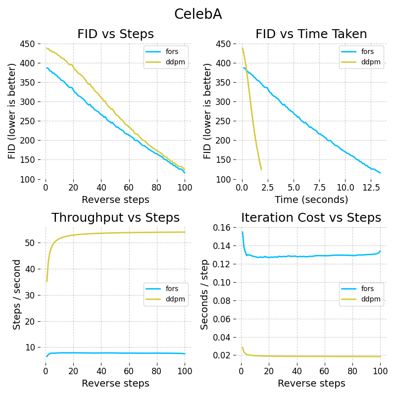

# FORS Diffusion Sampler (DDPM-like)

Here's a minimal implementation of the **FORS DDPM‑like sampler** (Section 4.2 of `fors.pdf` in [Chen et al. (2026)](https://arxiv.org/pdf/2602.01338)) and a driver notebook for comparing it to DDPM and DDIM on CelebA.

**Results (CelebA, DDPM vs DDIM vs FORS)**



## Contents
- `fors_sampler.py`: Implementation of DDPM‑like FORS sampler.
- `fors_driver.ipynb`: Driver notebook that runs sampling and plots results.
- `figs/celeba_results.png`: Plot exported from the notebook.

## Usage
1. Install dependencies (I've only attached the uncommon ones, `numpy` and all aren't included):
   ```bash
   pip install diffusers torch torchvision torchmetrics accelerate tqdm
   ```
2. Open and run the notebook:
   ```bash
   jupyter lab fors_driver.ipynb
   ```
3. In the notebook, adjust the config block if needed:
   - `model_id`: checkpoint (default set to `google/ddpm-celebahq-256`)
   - `step_count`: number of reverse steps to evaluate
   - `num_images`, `num_real`: FID sample sizes
   - `fast_mode`: quick runs

The notebook will save per‑step results to CSV under `fid_cache/results/`.

## Notes
- FORS is slower per step than DDPM/DDIM due to rejection sampling. Each rejection sampling step should terminate in around 5-15 iterations if everything is okay. In practice this is a ~9x slowdown, but each iteration gets more progress. 
- If you're impatient, you can use `fast_mode = True` for quicker but not very accurate plots.
- The provided plot is generated from the notebook and saved as `figs/celeba_results.png`.
